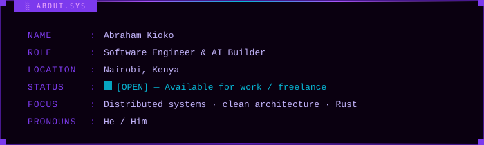
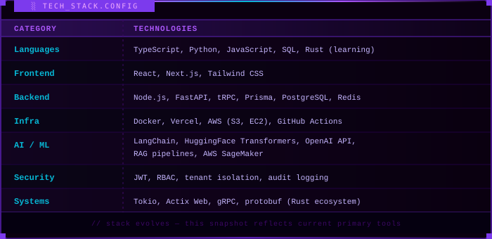

<!-- ============================================================
     ABRAHAM KIOKO — GitHub Profile README
     Retro terminal aesthetic
     Username: abraham-heuy
     ============================================================ -->

 

 

 

 

 

 

 

---

## ░ GITHUB_STATS.SYS

---

## ░ CONNECT.SH

---

